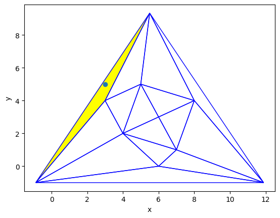

# Opis
Algorytm Kirkpatricka - algorytmy pozwalający lokalizować przynależność punktu w przestrzeni 2D do jednostki podziału - trójkąta triangulacji. <br>
Algorytm wymaga preprocessingu w czasie $\mathcal{O}(n \log{}n)$ <br>
Następnie każde zapytanie dla przygotowanego wielokąta realizowane jest w casie $\mathcal{O}(\log{}n)$
<br>
<br>
Biblioteka składa się z pakietu `visualizer`, który wykorzystywany jest przez bibliotekę do wizualizacji działania algorytmu i wyniku lokalizacji. Właściwa biblioteka znajduje sie w pakiecie `kirkpatrick_point_location`, zbiera ona funkcje potrzebne do działania algorytmu w przyjazny interfejs. W pakietach można znaleźć 
Notebook jupytera pokazujący działanie poszczególnych etapów działania algorytmu.
<br>
<br>
Do triangulacji początkowej figury użyto triangulacji Delaunaya, a następnie do triangulacji "dziur" powstałych przez usunięcie zbioru niezależnych wierzchołków użyto algorytmu earcut.

# Instalacja

Najpierw sklonuj repozytorium będąc w folderze do którego chcesz je sklonować, na przykład za pomocą:

```
git clone https://github.com/lkwinta/Kirkpatrick-Algorithm.git
```

Pobierz Anacondę, odpal Anaconda Prompt i przejdź do folderu Algorytmy-Geometryczne, tam stwórz środowisko:

```
conda create --name kirkpatrick python=3.9
conda activate kirkpatrick
```

Następnie uruchom:

```
python3 setup.py sdist
python3 -m pip install -e .
```
Otwórz Jupyter Notebook z listy programów w Conda Navigator, pamiętaj, żeby na górze zaznaczyć Twoje środowisko (kirkpatrick). Jeśli nie znajduje modułu kirkpatrick spróbój zrestartować środowisko i jupytera:
```
conda deactivate
conda activate kirkpatrick
```


W celu uniknięcia błędów wziązanych ze ścieżkami do różnych wersji interpreterów pythona sugerujemy korzystanie z Linuxa, a na Windowsie zainstalowanie WSL-a i właśnie w nim uruchamianie wszystkich komend.

# Korzystanie z biblioteki

Aby użyć biblioteki należy ją zaimportować w poniższy sposób:
```py
from kirkpatrick_algorithm.kirkpatrick_point_location.point_location import Kirkpatrick
```
Następnie definiujemy przykładowy wielokąt i inicjalizujemy nim obiekt biblioteki. Konstruktor przyjmuję listę krotek będących współrzędnymi punktów wielokąta.
```py
polygon = [(5,5), (3,4), (6,3), (4,2), (6,0), (7,1), (8,4)]
kirkpatrick = Kirkpatrick(polygon)
```
Kolejnym potrzebnym krokiem jest wywołanie funkcji przetwarzającej wielokąt. Bez tego algorytm będzie wyrzucał wyjątek przy próbie lokalizacji punktu.
```py
kirkpatrick.preprocess()
```
Samą lokalizację punktu wywołujemy przez funkcję `query`, która przyjmuje krotkę ze współrzędnymi punktu do lokalizacji, a zwraca obiekt `Triangle` z biblioteki `planegeometry` jako zlokalizowany
trójkąt. Gdy punkt znajduje się poza zewnętrznym trójkątem, funkcja zwraca None.
```py
found_triangle = kirkpatrick.query((3, 5))
```
Listę wszystkich trójkątów można otrzymać funkcją `get_triangles()`.
```py
all_triangles = kirkpatrick.get_triangles()
```
Można też skorzystać z funkcji `query_with_show`, która lokalizuje punkt oraz rysuje wszystkie trójkąty oraz zlokalizowany trójkąt.
```py
kirkpatrick.query_with_show((3, 5))
```


# Żródła
https://ics.uci.edu/~goodrich/teach/geom/notes/Kirkpatrick.pdf
